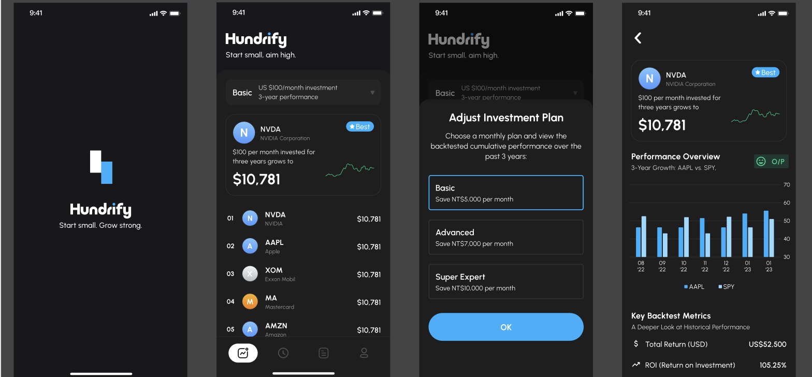

# Hundrify Product Roadmap
Start small, grow strong.

## Product Vision
Hundrify 存在的目的是幫助用戶 **「透過每個月定期定額100美元，提早達成財務目標」**。
我們將透過提供用戶簡單清楚的目標設定功能、明確的獎勵機制讓它在Hundrify確實養成定期定額習慣。
我們相信，理財投資不該是專家的權利，而是每個人都能掌握的日常習慣。Hundrify 的存在，是為了讓「小額、持續、目標導向」的投資方式，變得簡單而有動力。

## 我們的產品方向與優先任務
目前團隊最核心的任務是，完成打造一個能讓用戶「設定目標 → 定期投資 → 追蹤進度 → 感受到成就」的最小可行版本。
我們當前的重點如下：

### 近期最重要的功能
- **Milestone 計畫UI (尚未開始)**
  - 用戶要能建立某個定期定額的計畫（Milestone）
  - 給用戶具體視覺化的目標成就感
  - 團隊所有設計、功能優化都圍繞這個目標優先完成

- 最迫切要完成的功能
  - **翻新App顏色設計稿**：因此商店與行銷等都能依據此版本開始進行
  - **首頁新增第一名詳細資訊**：藉此讓使用者能一眼了解首頁的數據
  - **公司知識小卡**：協助用戶理解公司最新資訊，提升對於個股的掌握與信心

### Roadmap
|功能|優先級|負責人|目標週期|狀態|預計版本號|
|--|--|--|--|--|--|
|上架第一版|⭐⭐⭐⭐⭐|Marra|四月初|Done|1.0.20|
|Milestone 計畫UI|⭐⭐⭐⭐⭐|JJA|4/21~5/10|In Progress|1.2.0|
|翻新App顏色設計稿|⭐⭐⭐⭐⭐|Marra|4/16~5/10|In Progress|1.1.0|
|首頁新增第一名詳細資訊|⭐⭐⭐⭐|Marra|4/20~5/10|In Progress|1.1.0|
|公司知識小卡|⭐⭐⭐|Marra|4/20~5/10|Not Started|1.1.0|
|App Header 動畫|⭐⭐⭐|Marra|4/21~4/23|Done|1.1.0|

### 測試指標

- Milestone 計畫UI : Figma 設計稿
- 翻新App顏色設計稿：[對齊這一版Figma顏色稿](https://www.figma.com/design/5HtqUBwfmZeugD1lgn72nL/Hundrify?node-id=434-19719&p=f&t=XJNiTyoQDfieOisf-0)
- 首頁新增第一名詳細資訊：首頁看見第一名的定期定額累積資產 跟年化報酬等資訊
- 公司知識小卡：從知識小卡可以看到前20大公司的最新狀態
- App Header 動畫：App 滑動可以看到上方Header縮小的變化

### 想法/未來功能庫
- Firebase 數據埋點
- 通知功能要能激活用戶
- 撈取數據的速度優化

### 討論區(每週更新)
- JJA 認為公司知識小卡是強功能，是否增加分享路徑？
- Marra 問，如何建立前面10個黏著度高用戶？